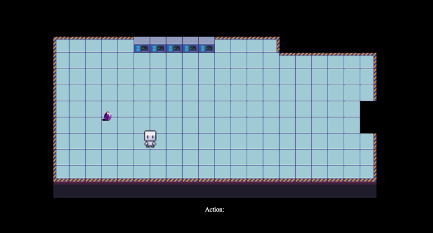
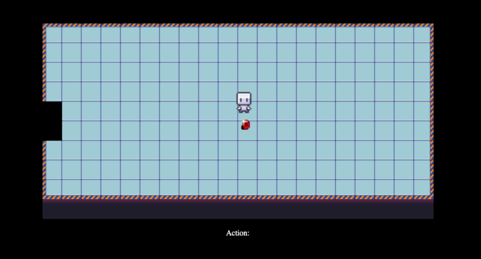

# Role-Playing-Game

## Overview

This is my first project in General Assembly Software Engineering Immersive Flex Course. After finishing the first module which consist Vanilla JS, HTML and basic CSS we are asinged to create a single page game.

I decided to grow out of my comfort zone and venture into creating a Role Playing Game which consist of a hero character roaming around and interact with different object.

This Readme will outline my approach I took and what challenges I encountered.

## Brief

- Using Object Oriented Programming Principal to design the logic of the game
- Include seperate HTML,CSS,JS files
- Using canvas in HTML

### Game Brief

- The player able to move the hero around
- The player able to drop and pick up objects (in this case gem)

## Timeframe and Technology

### Timeframe : 10 days

### Front End:

- JavaScript
- HTML
- CSS

Dev Tools:

- VSCode
- Git
- Git Hub
- Google Chrome Dev Tools

## Features and Pages

- This a single page application
- User will use keys to direct the page/ game
- Move around : [W,A,S,D]
- Pick Up : [P]
- Drop : [O]

## Instruction

- Player will use basic key to move the character around the map
- The player then have to collect gems to win the game
- Player able to move the hero to the next to discover more object
- Player will then gain to the next level

## Approach Taken

- In this project, my main concern is creating many game object repeatedly. This lead me to focus on using the Object Oriented Principles to create my game.

- The very first thing I do in this project is planning how my basic game gonna look like and the action that the game can have. Then I worked on the movement of the main character on the canvas. (At this point my main character is just a box)

- After successfully have my character movement, I moved on on creating the character action (picking up object). This initially caused me some thinking and finally realise I can have a inventory attributes on my class object which I will build once character movement is done.

- At this point I have all the basic character movement done. So I started to work on the class object. This is my first project where I use class object at a higher level. This gave me some challenge, and I overcome it by reading documentations and the functionality it able to porvide using the method.

```
class Character{
    constructor (position,direction,label,mapLevel){
        this.position = position
        this.direction = direction
        this.label = label
        this.Inventory = []
        this.currentMap = mapLevel
    }

    pickUp(gameObject){
        this.Inventory.push(gameObject)
        gameObject.position.y = -100
        gameObject.position.x = -100
    }

    drop(gameObject){
        this.Inventory = this.Inventory.filter((item) => {
            return item !== gameObject
        })
        if(this.direction == 0){
            gameObject.position.x = this.position.x + scaleWidth/2 - 24/2
            gameObject.position.y = this.position.y + scaleHeight - 24/2
        }else if(this.direction == 1){
            gameObject.position.x = this.position.x + scaleWidth/2 + 32/4
            gameObject.position.y = this.position.y + scaleHeight/2 + 32/4
        }else if(this.direction == 2){
            gameObject.position.x = this.position.x + scaleWidth/2 - 32/2
            gameObject.position.y = this.position.y
        }else if(this.direction == 3){
            gameObject.position.x = this.position.x
            gameObject.position.y = this.position.y + scaleHeight/2 + 32/4
        }
    }

}
```

- Once the class object for character and game object is set, I moved on and worked on the map of the game. In this I also used ocject oriented method and using 10 arrays to build a single map. Where each array contain number from 0 to 12, where each number give different sprite image of the floor in the game. (Sprite Images get from online)

- Lastly, I'm able to use the class object that I built previously to create more game object and character. I also able to use the object to create map layout. I also learnt new animation technique on character sprite sheet which allow my character to be more lively.

## The Game




## Wins

- This is the first RPG game I built and I learnt a lot about Object Oriented Principle Programming method. This game not only can have amazing story it also quite visualy stunning. I also seperated and segregate my code into different JS files which makes it more readable

## Challenges

- The main challenge I faced is coming up with the class object and how I'm able to use it in my game. To do this, I learnt through open resources on internet and not being afraid of using the principle into my game even it causes many errors.
- One of the mistakes I did where I think is important in this project is that always plan before start coding. In my case, I did not think far ahead and this made me to recode the map layout over and over again. However, it is a worth while effort to learn one of the most important priciples in coding.

## Learning Process

- Object Oriented Programming is the objective for me in this project, and I able to practice the method extensively.
- I learnt a huge amount about project planning and structure, especially planning a project effectively as it able to prevent the mistakes I had in this project

## Future Features

- Have a game menu and instructions for the player.
- Having a story and audio to the game (now only picking up object)
